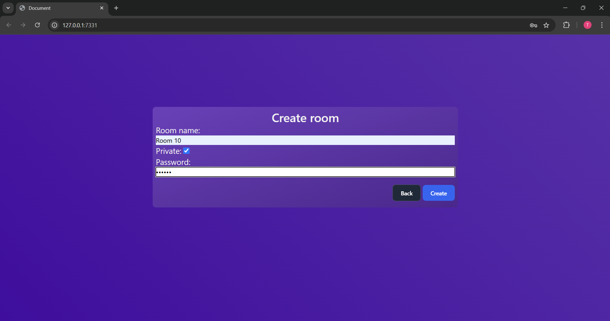
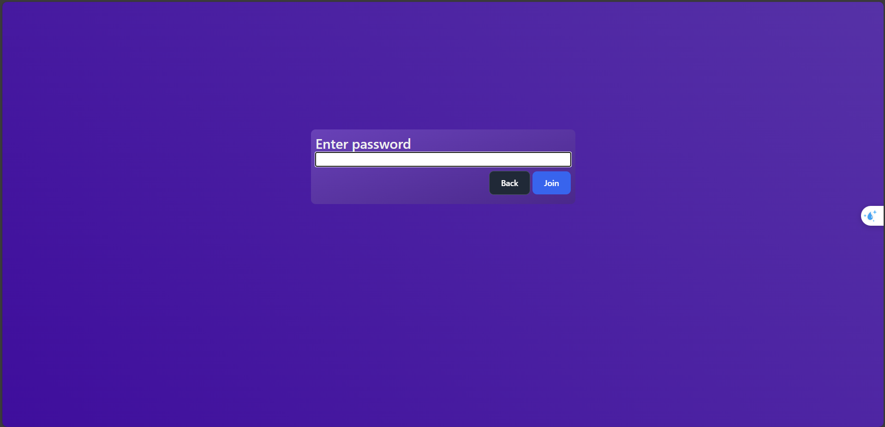
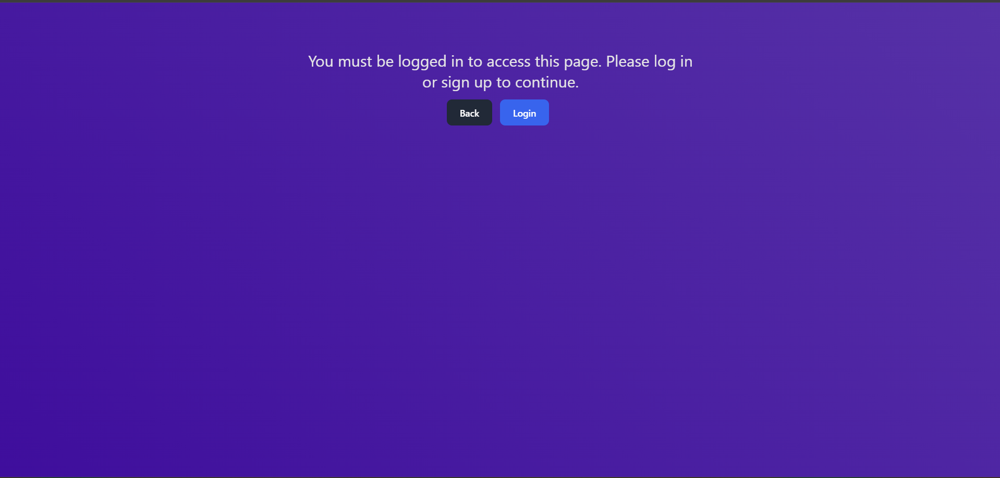
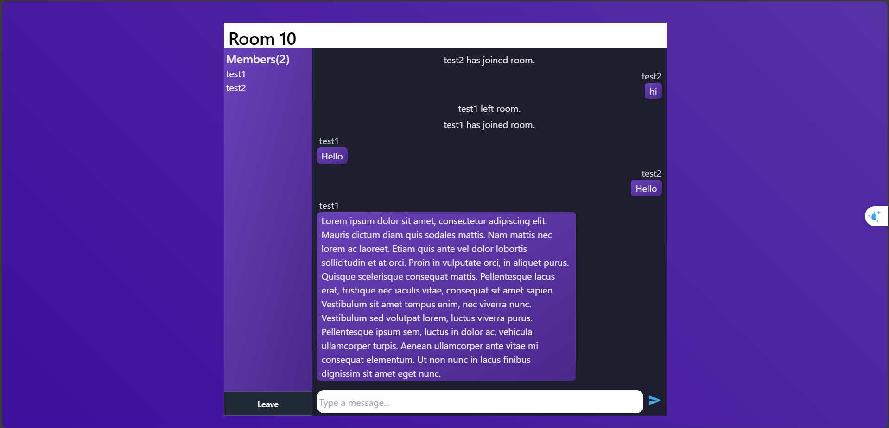

# Go-HTMX-ChatApp

A real-time chat application built using Go and HTMX.

## Description

Go-HTMX-ChatApp is a minimalistic, real-time chat application designed to demonstrate the capabilities of Go and HTMX for building dynamic web applications. This app allows users to join a chat room and engage in real-time messaging.

## Features

- Real-time messaging
- Multiple chat rooms
- User-friendly interface
- Lightweight and efficient

## Installation

To run this project locally, follow these steps:

1. **Clone the repository**:
```sh
git clone https://github.com/TuanLe53/Go-HTMX-ChatApp.git
```

2. **Navigate to the project directory**:
```sh
cd Go-HTMX-ChatApp
```

3. **Install dependencies**:
```sh
go mod download
```

4. **Run the application**:
```sh
go run main.go
```


## Usage

Once the application is running, you can access it via your web browser at `http://localhost:5050`. Join a chat room or create a new one to start chatting with others in real-time.

## Screenshots

*Include screenshots or GIFs demonstrating the application's interface and functionalities.*





